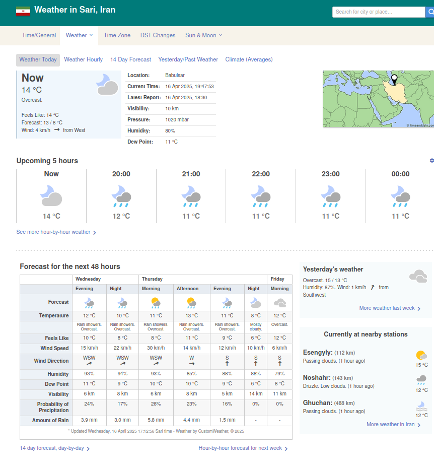
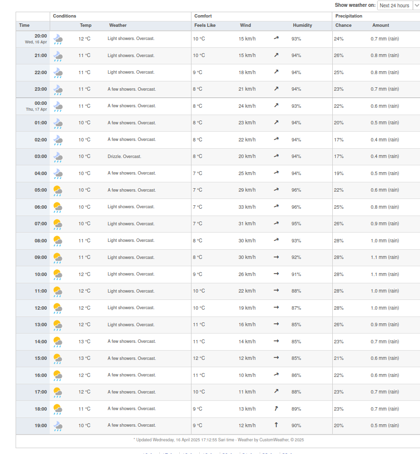
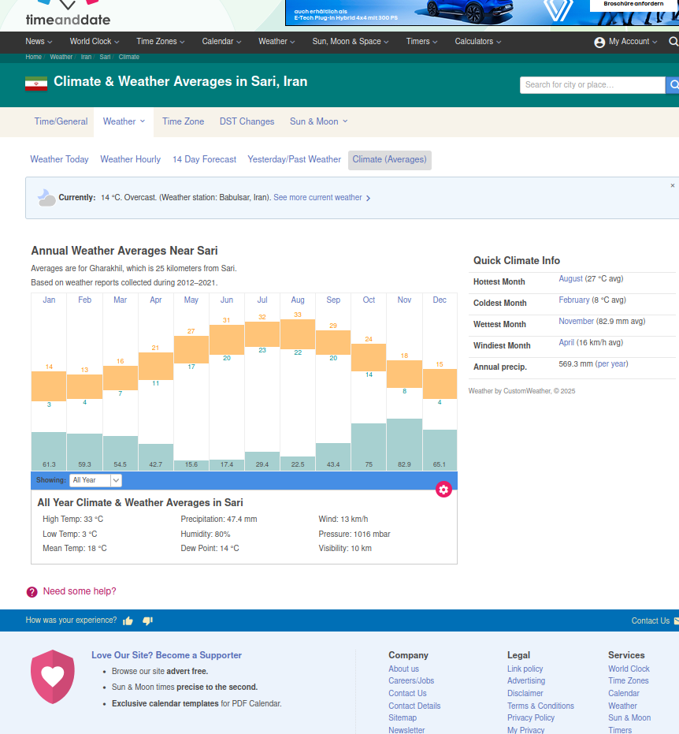

```{r setup, include=FALSE}
knitr::opts_chunk$set(tidy.opts = list(width.cutoff = 80), tidy = TRUE)
```
## Section A
in this section firstly we try to Retrieve the data from the summary table „Forecast for the next 48 hours“ and summarize its information. Firstly we read the whole of HTML file named"Weather for Sari, Iran.html". The city I have choosen is Sari, a city in Iran. In the code below I have find the table with html_elements and looking for a text with the value of ""Forecast for the next 48 hours"". This section has lots of table but the one we are looking for is the first one so I used position() function and make it equal to 1. So the main table is assigned to main table and can be seen below.
This table consists of the 2 days, Monday and Tuesday, and the times of the day. 

```{r }

library("rvest")

main_html = read_html("Weather for Sari, Iran.html")

selected_section <- main_html %>% 
  html_elements(xpath = '//*[text() = "Forecast for the next 48 hours"]') %>% 
  html_elements(xpath = '..')

main_table <- selected_section %>% 
  html_elements(xpath = './/table[position() = 1]')

information = main_table %>% html_table()
print(information)
```



## Section B
In this section I visualize the predicted development of temperature, wind, and humidity for the next 24 hours (retrieve the data from „Detailed Hourly Forecast - Next 24 hours“), firstly I take the html file named "Hourly forecast for Sari, Iran.html". and get the related rows. I useed lapply and rbind to combine the rows together. Below you can see all of the information in related to wether in 24 hours in this city.

```{r,tidy=TRUE}

hourly_data_html <- read_html('Hourly forecast for Sari, Iran.html')
selected_section_hourly = hourly_data_html %>% 
  html_elements(xpath = '//*[@id= "wt-hbh-title"]') %>% html_elements(xpath = '..')

main_hourly_rows <- selected_section_hourly %>% 
  html_elements(xpath = './/table[position() = 1]//tr[position() > 1]')

 
table <- main_hourly_rows %>%
  lapply(function(row) {
    row %>% html_elements("td") %>% html_text()
  }) %>% do.call(rbind, .) %>% as.data.frame()

colnames(table) <- c( "Conditions" ,"Temp" , 	"Weather",	"Feels" , "Like" ,	"Wind" ,	
                      "Humidity" ,	"Chance" , "Amount")

print(table)

```
As you can see in the table above all of the nubers are charachter and they are not the pure number. For example the have some strings like : "°C". we have to eliminate them and get the number. In order to this I used "gsub()" function which eliminate the other strings and return just the numbers. We have to use function "as.numeric()" to convert it to numeric.
Now we can use this numbers to illustrate the scatter plot.

```{r,tidy=TRUE}

Humidity <- gsub("%", "", table[1 :23 , "Humidity"])
Humidity <- as.numeric(Humidity)

Temp <- gsub("[^0-9]", "", table[1 :23 , "Temp"])
Temp <- as.numeric(Temp)

Feels <- gsub("[^0-9]", "", table[1 :23 , "Feels"])
Feels <- as.numeric(Feels)

print(Humidity)
print(Temp)
print(Feels)


```
 Here we firstly use these numbers to a dataframe. and than use ggplot and geom_point() to draw them.

```{r,tidy=TRUE}
library(ggplot2)

Humidity_df <- data.frame(
  Hour = 1:23,                    
  Humidity_col = Humidity[1:23]   
)

Temp_df <- data.frame(
  Hour = 1:23,                    
  Temp_col = Temp[1:23]            
)

Feels_df <- data.frame(
  Hour = 1:23,                     
  Feels_col = Feels[1:23]         
)

ggplot(Humidity_df,  aes(x = Hour , y = Humidity_col)) + 
  geom_point(size = 2) + 
  labs(x = "Hour", y = "Humidity", title = "Humidity  Over Hours") 

ggplot(Temp_df,  aes(x = Hour , y =  Temp_col)) + 
  geom_point(size = 2) + 
  labs(x = "Hour", y = "Temp", title = "Temp  Over Hours") 


ggplot(Feels_df,  aes(x = Hour , y = Feels_col)) + geom_point(size = 2) + 
  labs(x = "Hour", y = "Feels", title = "Feels  Over Hours") 

```

In the diagrams above, we have the "Feels of temperature, real temperature and over next 24 hours". As it is shown the temperature and also its feeling is very low in the first hours of the day, however the precentage of humidity is high.

## Section C
In this section we are going to check the avarage, highest, lowest temperature, Precipitation, Humidity, Wind, Pressure and the Visibility in whole of the year and also each month. So we will have 13 numbers for each of them. 
In the following code cell firstly we read the HTML file and use html_element function to access the table with Id of "climateTable". This table contains the information related to the wether in the year.

```{r,tidy=TRUE}

annual_temp_avarage = read_html("Climate & Weather Averages in Sari, Iran.html")
information <- annual_temp_avarage %>% 
  html_elements(xpath = '//*[@id= "climateTable"]//p') %>% html_text()
print(information)


```
We need just the information about Temperature and precipitation.

```{r}
information_high_temp <- annual_temp_avarage %>% 
  html_elements(xpath = '//*[@id= "climateTable" ]
                //div[@class = "four columns" and position()=1]//p[position() = 1]') %>% html_text()

information_low_temp <- annual_temp_avarage %>%
  html_elements(xpath = '//*[@id= "climateTable" ]
                //div[@class = "four columns" and position()=1]//p[position() = 2]') %>% html_text()

information_mean_temp <- annual_temp_avarage %>% 
  html_elements(xpath = '//*[@id= "climateTable" ]
                //div[@class = "four columns" and position()=1]//p[position() = 3]') %>% html_text()

information_precipitation <- annual_temp_avarage %>% html_elements(xpath = '//*[@id= "climateTable" ]
            //div[@class = "four columns" and position()=2]//p[position() = 1]') %>% html_text()

print(information_high_temp)
print(information_low_temp)
print(information_mean_temp)
print(information_precipitation)

```
As I mention before the information in the tables have some other characters such as "C" or "%" which has to be deleted.
so we use gsub function. this function can eliminate the characters that we want and replace them by another charachter. Hier we choose "", maens nothing. It returns a character value, so we need to use as.numeric to convert it to numeric attribut.

```{r,tidy=TRUE}
high_temp <- as.numeric(gsub("[^0-9]", "", information_high_temp))
low_temp <- as.numeric(gsub("[^0-9]", "", information_low_temp))
mean_temp <- as.numeric(gsub("[^0-9]", "", information_mean_temp))
precipitation <- as.numeric(gsub("[^0-9]", "", information_precipitation))/10


print(high_temp)
print(low_temp)
print(mean_temp)
print(precipitation)

```
This is the results. Pay attention, we have 13 numbers. Beacuse we have also the onformation for whole of the year.

```{r,tidy=TRUE}

final_table <- rbind(high_temp , low_temp, mean_temp, precipitation)
colnames(final_table) <- c("All year" , "January" , "February" , "March" , 
                           "April" , "May", "June" , "July" , "August" , "September" ,
                           "October" , "November" , "December")
print(final_table)

```


In this section, the diagrams are illustrated. As you can see, in the first and last month of the year the wethear is vey cold but in the middle which is sommer, This city is very warm.
```{r,tidy=TRUE}

High_df <- data.frame(
  Month = 2:13,                    
  High = high_temp[2:13]           
)

Low_df <- data.frame(
  Month = 2:13,                     
  Low = low_temp[2:13]          
)

Mean_df <- data.frame(
  Month = 2:13,                    
  Mean = mean_temp[2:13]          
)

Precision_df <- data.frame(
  Month = 2:13,                   
  Precision = precipitation[2:13]          
)


ggplot(High_df,  aes(x =Month , y = High )) + geom_point(size = 2) +
  labs(x = "Months", y = "High Avarage" ) 

ggplot(Low_df, aes(x = Month , y = Low )) + geom_point(size = 2) + 
  labs(x = "Months", y = "Low Avarage" ) 

ggplot(Mean_df , aes(x = Month , y = Mean )) + geom_point(size = 2) + 
  labs(x = "Months", y = "Mean" ) 


ggplot(Precision_df , aes(x = Month , y = Precision )) + geom_point(size = 2) + 
  labs(x = "Months", y = "Precision" ) 


```


```{r,tidy=TRUE}
annual_max <- high_temp[1]
annual_min <- low_temp[1]
annual_mean <- mean_temp[1]
annual_precision <- precipitation[1]

print(paste("The annual min tempreture is :" , annual_max, "°C"))
print(paste("The annual max tempreture is :" , annual_min , "°C"))
print(paste("The annual mean tempreture is :" , annual_mean, "°C"))
print(paste("The annual precision  is :" , annual_precision, "mm"))

```


## Some of the functions I used.

1. read_html : With this function we can read an html file.
2.html_elements : with  this function we can access to the structure and information of the html file.
3.html_table : whit this function we can read and return the information of a table in html as a table.
4.lapply: with this function we can applay a function on each row of a table.
5.html_text : with this function, it is possible to get just the text from an html element.
6. colnames : with this function we cant assign the names of the columns in a data frame using vector. ex:
  colnames(table) <- c("a" , "b" , "c")
  in the code above we assign "a" to the first column, "b" to the second and "c" to the third one.
7. gsub : with this function, we can eliminate some characters and replace them with another character.
8. as.numeric, as.Data.Frame, ... : using them we cen read the variables as an specific type.


